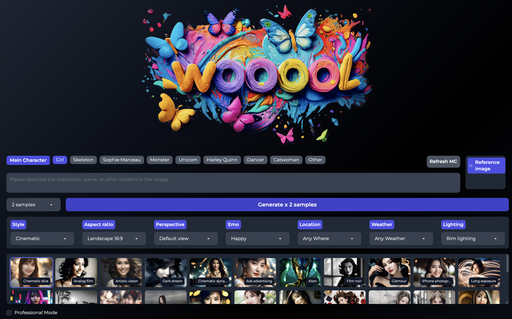
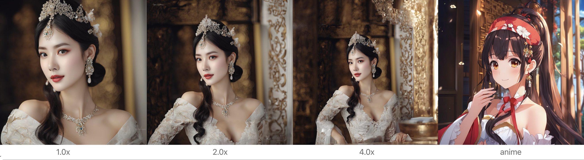

# Wooool web UI

Wooool is an AIGC image generator, Refer to the functions from[Stable Diffusion web UI](https://github.com/AUTOMATIC1111/stable-diffusion-webui) 、Midjourney and [Fooocus](https://github.com/lllyasviel/Fooocus). it supports SD1.5 and SDXL model



## Features

### Prompt
given multiple chioces instead of filling the blank to complish the description.
shaping the whole view gradually by description with photographic words. 
- Main Character: provides more than 40 types of profiles including female and male by default. Each refresh displays a new group of people.  according to the selected language, different races would be displayed automatically to satisfy different aesthetics from different regions.
- Integrated [Dynamic Prompts](https://github.com/adieyal/dynamicprompts), the option could be shown by random or in other way if you choose the function
- Support to setting the weight of options
- Options have large content of many elements like perspective, emo, location, weather, lighting and so on, which are more logical for photography
- SDXL Style selection, each sample picture for each style
- Weights can be set separatlly for each content such as Main Character or SDXL style

### Reference Image
Anything is a reference image
- IPAdapter，Reference All(IPAdapter) 和 Face only(IPAdapter Face)
- Controlnet，Layout only(Canny)、Depth only(Depth)、Pose only(DWPose)
- Wd14Tagger, Content only
- Base Image, Img2img

### Fine tune (Lora Model)
Integrate the Civitai API to quickly preview and switch trigger words

### Actions



- Vary(Subtle) and Vary(Strong), Midjourney Vary.
- Zoom(1.5x) and Zoom(2.0x), Midjourney Zoom
- Change Style, Transfer styles between SDXL styles
- Resize, switch between different sizes, similar to Photoshop fill
- Refiner(Image)，Faces are protected. The proportion of faces is too small
- Refiner(Face)，similar to the After Detail plug-in, the face is enlarged and refined
- ReFace，replace face
- Upscale，4x in HD

### Gallery
Integrating image browser with generating preview galleries for easier management of generated images

### Performance
- The multi-threading mode enables the CPU and GPU to help share the processing workload and make the processing of prompt,picture generation and VAE in parallel. therefore,the video memory switching could be reduced and let the whole process speed up.

### Configuate
- config/user_paths.json, configure the model and the file directory
- config/download.json, configures the download address of the model
- config/localization, multi-language configuration
- config/sd_styles, SDXL configuration

### Installation

```bash
python launch.py
```

### License and Acknowledgement

This project is released under the MIT license.

### :e-mail: Contact

If you have any question, please send an email to the following address:`kevinwangling@gmail.com`.