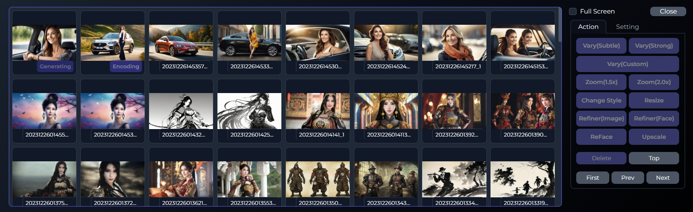

# Wooool web UI

Wooool is an AIGC image generator, Refer to the functions from[Stable Diffusion Web UI](https://github.com/AUTOMATIC1111/stable-diffusion-webui) 、Midjourney and [Fooocus](https://github.com/lllyasviel/Fooocus)

- Supports SD1.5, SDXL, SDXL Turbo, SDXL Lightning, Playground V2 and V2.5 Checkpoints, Loras, Controlnets and IPAdapters.
- The redesigned UI interface has greatly improved usability.


## Release
- [0.9.1] [2024/04/14]🔥 Support new image to text model, Moondream-v1/v2, Qwen-5b and Wd14-v3
- [0.9.0] [2024/04/06]🔥🔥🔥 When lowvram split model to inference, only 2G VRAM required to perfectly run the SDXL model 
- [0.8.9] [2024/04/04]🔥🔥 Adjust the model to fp8 at anytime, support IPAdapter mask and bria remove background controlnet
- [0.8.8] [2024/03/21]🔥🔥🔥 Support playground V2.5, cascade, layered diffusion, lighting, tcd, sdxl tile, freeU and differential diffusion
- [0.8.7] [2024/02/15]🔥 Support instant id, controlnet use fp8
- [0.8.6] [2024/02/06]🔥🔥🔥 Support IPAdapters faceid and portrait, style aligned, better integration of multiple IPAdapters
- [0.8.5] [2024/01/18]🔥 Inpaint adds vary after erase, any combination of sd15 and sdxl, controlnet supports multiple preprocessors
- [0.8.4] [2024/01/13] New UI, upgrade lora, upscale, vary, endless etc
- [0.8.3] [2024/01/05]🔥🔥🔥 Support more controlnet, densepose, animal_pose, lineart, lineart_anime, manga_line, mlsd, normalbae, oneformer, sam, tile, depth_zoe, qrcode, brightness, recolor, color, style
- [0.8.2] [2023/12/30] Optimize extended image, support zoom(custom), resize and refiner(face)
- [0.8.1] [2023/12/30] Support random style, vary(Custom), configuration auto save, Checkpoints and Loras link to civitai

## Features

### Prompt

Selecting is always better than filling in the blank. given multiple options from perspectives, location, weather, style, etc. to gradually improve the image description.
shaping the whole view gradually by description with photographic words. 
- Perspective: provides more than 40 different protagonist options, including girls, men, celebrities, Marvel characters, anime characters, animals, etc. Each refresh displays a new group of people.  according to the selected language, different races would be displayed automatically to satisfy different aesthetics from different regions.
- Integrated [Dynamic Prompts](https://github.com/adieyal/dynamicprompts), the option could be shown by random or in other way if you choose the function.
- Support to prompts the weight of options.
- Options have many elements like perspective, emo, location, weather, lighting and so on, which are more logical for photography.
- SDXL Style selection, Supports random style selection, and configures an elegant cover for each style.

### Reference Image (Controlnet + Img2img + Wd14Tagger)

Anything is a reference image
- IPAdapter，Reference All(IPAdapter), Face only(IPAdapter Face/FaceID/Portrait/InstantID)
- Controlnet，Layout only(Canny, Lineart, MLSD, Scribble, Softedge)、Depth only(Depth)、Pose only(DWPose, DWPoseFace, AnimalPose), Others(Tile, Seg, Recolor), etc.
- Wd14Tagger, Content only
- Base Image, Img2img

### Fine tune (Lora Model)

- Integrate the Civitai API to quickly preview , switch trigger words and link to detail page.
- Use the slider to adjust the Perspective, Style, Emo, and more.
- You can also configure Lora in the profiles of protagonist, style, location, etc.

### Actions


- Vary(Subtle) and Vary(Strong), Midjourney Vary.
- Vary(Custom), Inpaint.
- Zoom(1.5x) and Zoom(2.0x), Midjourney Zoom, Outpaint.
- Change Style, Transfer styles between SDXL styles.
- Resize, switch between different sizes, similar to Photoshop fill.
- Refiner(Image)，Faces are protected. The proportion of faces is too small.
- Refiner(Face)，similar to the After Detail plug-in, the face is enlarged and refined.
- ReFace，Replace face.
- Upscale，4x in HD.

### Gallery



Integrating image browser with generating preview galleries for easier management of generated images

### Performance

- The multi-threading mode enables the CPU and GPU to help share the processing workload and make the processing of prompt,picture generation and VAE in parallel. therefore, the VRAM switching could be reduced and let the whole process speed up.

### Configuate

- Powerful configuration management function that allows downloading any state configuration as a template and loading to use it anytime.
- The options on UI will be automatically saved and won’t be lost after refreshing.
- config/user_paths.json, configure the model and the file directory.
- config/download.json, configures the download address of the model.
- config/localization, multi-language configuration.
- config/sd_styles, SDXL configuration.
- config/wildcard, Wildcard configuration.
- config/ui, UI Interface configuration, Perspective, Aspect ratio, negative, sampler etc.

### Installation

```bash
python launch.py
```

### License and Acknowledgement

This project is released under the MIT license.

### :e-mail: Contact

If you have any question, please send an email to the following address:`kevinwangling@gmail.com`.